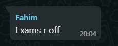

# The Demon On My Shoulder

The demon first arrived when I was twelve. Until then school had been quite fun really. Tests were of low priority and no one really stressed you out about them too much. Until year 8, when new management came under my school. They began to create stakes to the exams.

 I remember the first big maths exam they had us worry about. It'd determine which maths class you'd be in, they said. It was of upmost importance you do well for it, they said. 

 Around the same time, a demon appeared on my shoulder.

 I went to my teacher and asked what the demon was doing there, showing it to him. He said: "It's supposed to be there. You're fine."

 "Why is it here?" I asked. 

 "It reminds you to study," the teacher said with a smile. "Don't forget, you have an exam next week."

 I felt a sharp pain - the demon had dug its claws into my shoulder. 

 "Ow! What was that for?"

 "Have you studied yet?" my teacher said in response, as if the pain was normal. 

And so I woke up each morning, and I studied. I noticed whenever I studied the demon's latch onto my arm was lighter. The more prepared for the test I was the less it hurt, and when the exam came I aced it, and I noticed the demon was gone. I felt lighter.

— 

Over the next year, I grew accustomed to the demon's presence whenever a test came. The bigger the teachers said the stakes were, the worse the demon's claws hurt, but still I reliveshed the feeling of a painless shoulder at the end of every exam, when the demon let me go. 

Until one time, at the end of the summer exams, it didn't.

I went to my teacher and asked what the demon was still doing there. She said: "It's there to remind you to study over the summer of course! You have your Big Exams coming up in 2 years, remember? Time flies, you'll want to start studying now. Have a nice summer!"

My teacher walked out of the room, and the demon sunk it's nails deeper, piercing my uniform and tapping its claws against my skin. 

I was terrified. I'd adjusted to the demon's presence, knowing it left whenever I completed an exam. But the exam was two years away! Why would it stay for so long? Why worry me now?

I began to shake ferociously to try and get the demon off, a foolish, foolish move. I knew any attempts to reliquinquish myself from the demon's grasp would only lead to more pain, and this time wasn't an exepction. It dug its claws in depeer in retaliation, piercing through my skin. I cried out into the classroom. 

After a while, I apologised to the demon. 

It stayed.

—

After the summer, my sleep deteriorated. Some research showed me I was reaching the age where teenagers sleep cycle naturally drifted later into the morning, where simply tryiing to sleep earlier would have little effect. So I asked if I could go to school later in the morning. They laughed. They reminded me I couldn't miss lessons because of the Big Exams on the horizon. Still I tried, for months and months. But the daily energy I had been used to didn't return.

The demon didn't help. 

It didn't leave my shoulder during slumber. It didn't mellow during the night. It invaded my dreams, it poked and prodded me with it's needly razor sharp talons. 

And when it finally mellowed in the early hours of the morning, when my sleep would finally matter, the alarm rung. For a couple, blissful, amnesiatic seconds the Demon's presence was forgotten. 

Then the cycle spun back up.

These days I couldn't study. I couldn't focus, I had no energy. So I had no relief from the demon's pain. The less I studied the worse I did on tests, the worse I did on tests the bigger and stronger the demon grew. The bigger the demon was the more it weighed on me with every step I took, and the stronger the demon was, the more it invaded my sleep, yet worsening my energy, making the cycle only worse.

I went to my teacher and asked how to get rid of the demon.

"You don't *get rid of the demon*. Why do you think you can do that? I had to go through it, we all had to! The demon is good! It's presence builds character! These Big Exams are *very important* to your *entire future*, remember?"

I went to my mum and begged her to get the demon off me. She appeared to listen lovingly. I was hopeful, for a moment. She said:

"What did the teachers say?"

"That everyone goes through it.. and that it's good..."

She thought for a moment. "Ok, then what's the problem?"

"It *hurts* mum! I don't like it! It won't let me sleep! I didn't even ever ask for it to be here! I didn't want to do these tests! Please mum! Look at it!"

The demon on my shoulder was gigantic now, twice the size of me. I was constantly humped over in an attempt to balance it's gigantic weight on me. I almost felt like I was more demon than boy. It was so har these days to remember what I did before the demon arrived.

My mum looked at it, her face somehow remaining impassive. 

"What about it? That looks about normal."

"*Mum!!*"

"I went through it too, sweetheart. Everyone does. Don't worry about it, okay? Here, watch this video on study tips."

My shoulder bled.

——

Recently, something extroadinary happened.

 I had been learning of recently about stoicism. I was trying to take the demon's presence positively. It was working a tiny bit, but I still felt the note of discord within me. I still resented the demon. The fact that no one around me saw the demon for the disgusting monster it was made it infinitely worse. The fact that I was taken almost as a joke when I said I didn't want to do the Big Exams made it infinitely worse. 

 Recently, I was scrolling through a group chat I had made a while back, largely populated with people who had grown accustomed to their demon's presence. Hating it but rationalising it, resenting the obligation but relishing the opportunity. Doublethink, I knew it as. 

And as I was scrolling I saw something that made my heart stop. My body went from stationary to a million miles a minute, every cell in me vibrating ferociously as I tried to keep my emotions in check, incase it could be false. 

I suddenly felt a massive wind sweep through the air. It was like an invisible punch, rattling towards me, missing me at the last second and knocking square into the demon, sending it reeling off my shouler, disentigrating with the force of the blow. 

I overide control of my body, just incase the news was false. I slowly, *slowly* raised my other arm, moving down the fabric around my shoulder, expecting to see the bruises and dried blood from the last year of abuse from the demon. 

My shoulder was clear and healthy. 

I realised what this meant, and I *screamed*. I let the elation bubble through me, taking control of my body. I stood, and I *flew*. Without the demon's presence I was as light as a feather. I hadn't moved like this in *years*. It was a deeply foreign experience, and my brain could hardly grasp that this was a reality.

The demon on my shoulder was *dead*. I was, for the first time in years, *free*!

—

The mood in the group chat was quite different. They had taken the adults stories about the demon in stride, and they were terrified of their life prospects without the Big Exams to back them, without the piercing talons of their demons to keep them in check.

- there are millions more chidren who will go throught eh saem experience as above, and millions of children who have. Just because you've gone through a horrible experience, doesn't mean it's good or justifiable, or that it should be enforced on new, innocent lives. Resistance to Chronic Stress is not trainable. 

