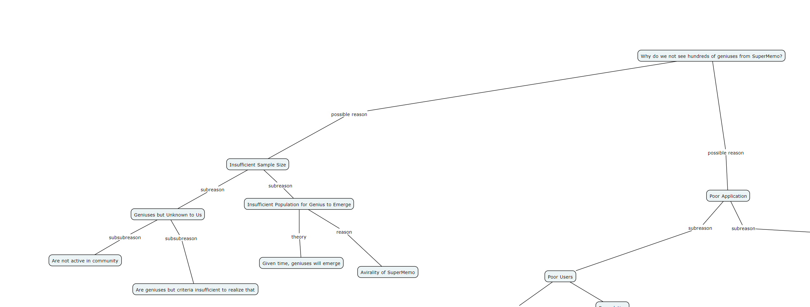
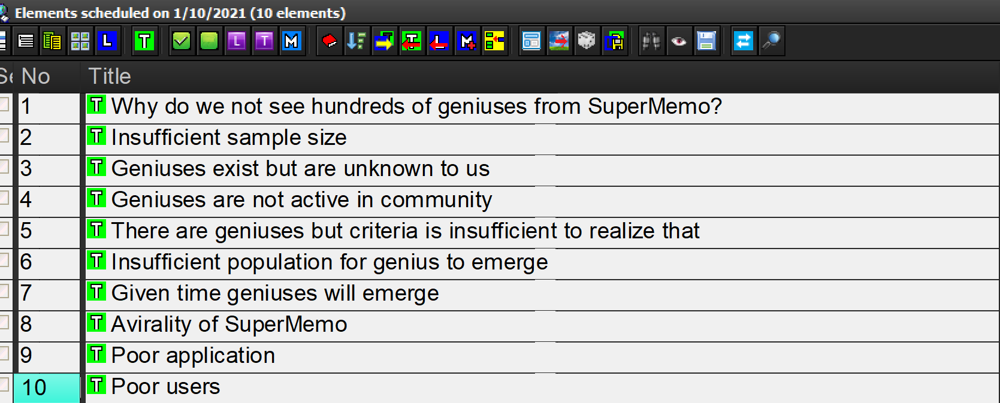

# Incremental Writing

(below is all for proposal of implementation in Foam)
## How does incremental writing work?

In SuperMemo, incremental writing is based on two facets: priorities and intervals. Imagine that I have [this mindmap](https://cmapscloud.ihmc.us/viewer/cmap/1W36TSP62-1HNRJQ4-DF) which I wish to convert into a wiki:

I can construct a simple writing queue:

and finish writing each post before moving on. This *functions* but has the downside of being in highly arbitrary order. Writing in order of last added or in random order is not efficient. SuperMemo handles this with priorities:

(0 is highest and 100 is lowest priority)

### Priorities

SM priorities are assigned by me and are at my discretion. SM then uses its sort algorithm which doesn't sort by pure priority (to prevent [prioritiy bias](https://help.supermemo.org/wiki/Priority_queue#Priority_bias_in_incremental_reading)). 
Using priorities, we can then go through list in less arbitrary order and get some added efficiency.

### Intervals
The problem with a priority queue by itself is that each operation is all or nothing; you have to finish writing top priority thing before moving onto 2. To fix this, in SuperMemo we use intervals:

(this is from my SuperMemo collection, to show actual intervals in action)

I'll get into the algorithm for intervals slightly later but in essence, when you see highest priority note, you can write as much as you want and know that interval will make it so that you can see it again later, you can move on to next one. (I'll call this [[incrementability]])

In this way, you can go through your queue and allocate as much time and attention as you'd like till you get bored and would like to move on. 
There are also strong benefits from:

- [memory consolidation](https://supermemo.guru/wiki/Memory_consolidation): when you write about something today and a few days later, in between your brain moves some of that to long-term memory and hones it; when you see it next you'll be able to think and write about it much better than your initial go. 
- if you have 7,000 notes, a priority queue by itself is not feasible. You'll never get to the bottom of it or even have the chance to see and possibly reprioritize other parts. With intervals, since there's space between reviews, there's more space for other material. In a year, I could feasibly get through and incrementally write 7,000 notes without going insane; I'm just juggling my attention over time.

# Foam Implementation
How would all this work in foam?
First off, you would want priority and interval metadata for each foam note. I don't think this would be hard. At start of each day (or scheduled time), you'd want a daemon to make queue of:

-notes with intervals due today

-sort order of queue by priority (more about sorting algorithm SM uses here)

You'd want to press a button and then see the first entry.
On seeing it, you want to be able to:

-reprioritize (in SM you press alt+p which brings up [this dialougue](https://super-memory.com/help/images/0/0d/Element_priority.jpg))

-modify interval manually (generally interval change would be based on algorithm outlined later but sometimes you want to be able to manually touch it. in SM, this is ctrl+j which leads to [this dialougue](https://lh3.googleusercontent.com/proxy/fmpECGwOScJHXjdj69_Mw4ovacMSXWVZyrvldBOnoLJhk_8E4M5MPoEVPtm7AZoRlv9SAWxGPojTlgoFlxdJvZ0nWLb6YLAxIphbbCZo_wetnZKUl0viZaPhDrWgWxjDuW8). you can either click calendar day you want to see it on or give it a number)

-write (obviously)

When you're done doing whatever you want to do with the note, you should be able to press something to move onto the next element in the priority queue. When you press next, the IW plugin should also generate next interval for finished element. 

### Algorithm
I vaguely recall there being more documentation on the algorithm supermemo uses for topics but I can't find it. The thrust of it is that SuperMemo generates new intervals by [a-factor](https://supermemo.guru/wiki/A-Factor) x interval = new interval. A-factor, from what I can tell, is influenced by priorities. For high priority material (0% is highest in SM), a-factor should be higher to modulate to more frequent review and the opposite for low priority material. 
I can probably ask Woz for more details on this though even something basic should be better than status quo. 

### Postpone
If you don't get through entire queue (very likely) you need some means of having queue handle that for overdone material. SuperMemo uses a feature called auto-postpone (documented [here](https://help.supermemo.org/wiki/Postpone)). It works well enough that I hardly know how it practically works since I never have to think about it. It doesn't seem that complicated and in simplest case you could just have things that you don't get to stay in queue and get sorted by priority against everything else. 

## Other Desired Features
I write on foam with my friend Space. It would be strongly ideal if we could do incremental writing seperately and his priorities and intervals didn't mess with mine. Probably possible with seperated metadata? It does seem like using IW could make it feasible to have multiple people incrementally contribute to refinement of some set of knowledge (which is what we're already doing, just more arbitrarily and at whim of what seems neatest to us in the moment).

## Further Work
I'm more than happy to call or talk much further with anyone interested in implementing this. I've used SM ~2.5 years and [taught](https://calendly.com/test0009/raj) [it](https://supermemo.wiki/start) it for 1, and for around 1 year also used IW, so I have a fair bit of experience.  
I'm on the Foam discord now as RajT [work]#9202 so maybe we could make a group there to collaborate?

## Other Ideas
You can look at your notes as a map/graph and then IW as a random traversal to incrementally shore up and improve parts of the graph. I wonder if you could use weights/links to decide where to go to maximize value (e.g. if you want to explore right now, you could weight towards orphans that don't have many connections or if you want to consolidate you could weight towards nodes that are well connected)

## Further Reading
For other explanations of incremental writing, I recommend these posts:

[Incremental Writing: No More Writer's Block](https://www.masterhowtolearn.com/2020-06-09-incremental-writing-no-more-writer-block/)

[The Magic Behind Incremental Writing: Spacing and Interleaving](https://www.masterhowtolearn.com/2020-08-09-the-magic-behind-incremental-writing-spacing-and-interleaving/)

[Incremental Writing in SuperMemo](https://help.supermemo.org/wiki/Creativity_and_problem_solving_in_SuperMemo#Incremental_writing)

[Incremental Writing Disambiguation Page on SuperMemo.guru](https://www.google.com/search?q=incrmenetla+writing&oq=incrmenetla+writing&aqs=chrome..69i57j0i13i30i457j0i13i30j0i5i13i30l3j0i8i13i30.1655j0j4&sourceid=chrome&ie=UTF-8)

[//begin]: # "Autogenerated link references for markdown compatibility"
[incrementability]: incrementability "Incrementability"
[//end]: # "Autogenerated link references"