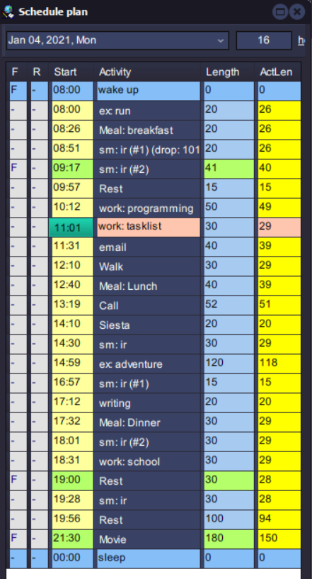

# Plan

Flexible method for organizing your day devised by [[Woz]]. It is included in [[SuperMemo]] and can be accessed by pressing Ctrl+P.

Better to have single habit of using plan than to have a hundred routines to manage by hand.

Consistenly using plan falls under having [[Future Consistency Ability]], as you can know excactly what you'll be doing a day, a week or a year in the future. 

If you are using Plan for the first time, it can be far more easy to begin from a template of someone elses and editing from there. Here is my current iteration:

Plans work best when they are aligned to the circadian rythm. 

[//begin]: # "Autogenerated link references for markdown compatibility"
[Woz]: Woz "Woz"
[SuperMemo]: SuperMemo "SuperMemo"
[Future Consistency Ability]: Future Consistency Ability "Future Consistency Ability"
[//end]: # "Autogenerated link references"